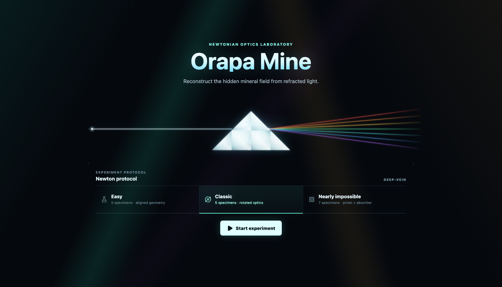

# Orapa Mine Cooperative

[](https://github.com/RemiGirard/OrapaMine/actions/workflows/pages.yml)

A cooperative, landscape-first deduction game about light, color, and hidden glass. One player or a family sends rays through a concealed mineral field, records the observed colors, and reconstructs the pattern together.

> This is an independent, fan-made digital project inspired by the Orapa Mine board game. It is not affiliated with or endorsed by the original publisher or designers.



## Play

**[Play Orapa Mine Cooperative](https://remigirard.github.io/OrapaMine/)**

The latest `main` branch is deployed automatically to GitHub Pages after every check passes.

1. Choose **Easy**, **Classic**, or **Nearly impossible**.
2. Click a row or column port to send a ray and record its entry, exit, and color.
3. Move the glass pieces from their foam case onto the family solution grid.
4. Rotate with right-click, flip with double-click or Shift-right-click, and compare the live optical paths with the clue notebook.
5. Submit the reconstructed field when every specimen is placed.

The game supports pointer, keyboard, and browser speech-recognition input. Voice availability depends on the browser.

## Features

- Cooperative play on one shared answer board.
- Five-piece basic puzzles and seven-piece prism/absorber puzzles.
- Whole polygonal glass pieces with position, orientation, and face state.
- Reversible input/output clues and deterministic color mixing.
- Diagnostic photons, verified light paths, and animated optical labels.
- Exact solution scoring with optional solution comparison.
- Keyboard-only controls and spoken row/column commands.
- Self-contained HTML build for offline play and GitHub Pages.

## Keyboard controls

| Key                        | Action                                         |
| -------------------------- | ---------------------------------------------- |
| `G`                        | Focus a glass control                          |
| `P`                        | Focus the first perimeter port                 |
| `B`                        | Focus the solution board                       |
| `Enter` / `Space`          | Pick up or place glass; send a focused ray     |
| Arrow keys                 | Move carried glass or navigate perimeter ports |
| `R`                        | Rotate carried or focused glass                |
| `F`                        | Flip carried or focused glass                  |
| `Escape`                   | Cancel the current glass movement              |
| `Delete` / `Backspace`     | Return carried glass to its case               |
| `A`                        | Toggle all background rays                     |
| `C`                        | Toggle the current verified ray                |
| `Ctrl+Enter` / `Cmd+Enter` | Submit a ready solution                        |

## Local development

Requirements:

- Node.js 22.12 or newer
- npm 10 or newer

```bash
npm ci
npm run dev
```

The development server runs at `http://127.0.0.1:3000`.

## Verification

```bash
npm run typecheck
npm run lint
npm test
npx playwright install chromium
npm run test:e2e
npm run build
npm run build:single
```

The standalone command produces `dist-single/orapa-mine.html`, with all JavaScript and CSS embedded.

## Architecture

The game is one bounded context under `src/modules/orapa-mine`:

- `domain`: board coordinates, minerals, colors, wave tracing, puzzles, and solution comparison.
- `application`: immutable use cases for clues, movement, keyboard input, submission, and session state.
- `infrastructure`: browser adapters for application ports such as speech recognition.
- `presentation`: React components, interaction hooks, and colocated CSS modules.

Dependencies point inward: presentation and infrastructure adapt the application layer, while the domain remains independent of React and browser APIs.

Further documentation:

- [Architecture and dependency rules](docs/architecture.md)
- [Implemented game rules](docs/orapa-mine-rules.md)
- [Reference workflows and use cases](docs/reference-use-cases.md)
- [Contribution guide](CONTRIBUTING.md)

## Deployment

`.github/workflows/pages.yml` runs formatting checks, TypeScript, ESLint, unit tests, Playwright tests, and the standalone production build. Successful pushes to `main` are deployed through GitHub Pages.

## License

The source code and original project assets are available under the [MIT License](LICENSE). The Orapa Mine name, original game, rules, and third-party trademarks remain the property of their respective owners; see [NOTICE.md](NOTICE.md).
